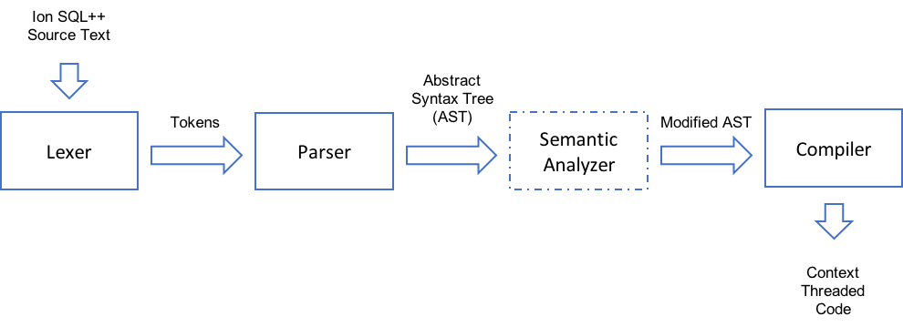
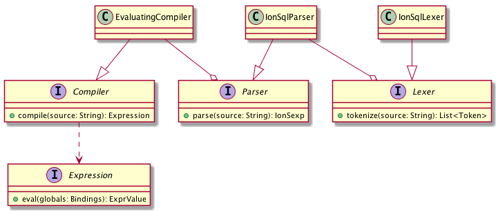
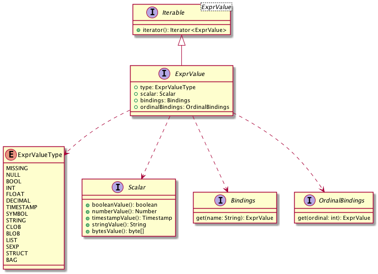

## Ion SQL++ Parser, Compiler, and Evaluator Design
This document provides the high-level design overview of the Ion SQL++ parser and evaluator. The high-level pipeline of compilation is illustrated as follows:



* The **lexer** is a hybrid direct/table driven lexical analyzer for Ion SQL++ lexemes that produce high-level tokens.
  * SQL is very keyword heavy, so having our own lexer implementation allows us to more easily normalize things like keywords that consist of multiple lexemes (e.g. `CHARACTER VARYING`)
* The **parser** is a basic [recursive decent parser][recursive-descent] for the Ion SQL++ language that produces an AST as an Ion S-expression.
  * For infix operator parsing, the parser is implemented as a Top-Down Operator Precedence (TDOP) [Pratt parser][pratt-parser].
* The **semantic analyzer** is a placeholder for general purpose semantic analysis.  This is not yet implemented, but important optimizations such as determining which paths/columns are relevant for a given query will be done by this phase.  Decoupling of the parser from the compiler, means that any application can do their own validation and processing of the AST.
* The **compiler** converts the AST nodes into [context threaded][context-threading] code.

### Context Threading Example
Context threaded code is used as the interpreter strategy to align the *virtual program counter* with the JVM's *program counter*.  This is done by *threading* the operations of the AST nodes into a tree of indirect subroutine calls.  Specifically, on the JVM, this is modeled as a series of lambdas bound to a simple functional interface.

We can illustrate this technique with a simple integer evaluator.  Consider the following interface that represents an evaluation:

```java
interface Operation {
  /** Evaluates the operation against the given variables. */
  int eval(Map<String, Integer> env);
}
```

We can *"hand code"* a simple compilation of `A + B` as follows:

```java
public static Operation compilePlus(Operation left, Operation right) {
  return env -> left.eval(env) + right.eval(env);
}

public static Operation compileLoad(String name) {
  return env -> env.get(name);
}

public static void main(String[] args) throws Exception {
  // a "hand" compilation of A + B
  Operation aPlusB = compilePlus(compileLoad("A"), compileLoad("B"));

  // the variables to operate against (i.e. the environment)
  Map<String, Integer> globals = new HashMap<>();
  globals.put("A", 1);
  globals.put("B", 2);

  // evaluate the "compiled" expression
  System.out.println(aPlusB.eval(globals));
}
```

It can be seen that the above example leverages lexical closures (lambdas) to build an object graph of state to represent the actual interpretation, the actual dispatch leverages the native call stack differs from straight compiled code in that each "opcode" is a virtual call.

### Evaluation Strategy
Evaluation is done by first compiling source text of an Ion SQL++ expression into an instance of `Expression` which provides the entry point to evaluation:



At the core of all evaluation is an interface, `ExprValue`, that represents all values:



This interface enables any application embedding the evaluator to control and provide data used for evaluation. The other benefit of this approach is that an interface allows for *lazy* evaluation.  That is, the evaluator can return an `ExprValue` that has not been fully evaluated.  This approach allows for the streaming of values when possible.

All `ExprValue` implementations indicate what type of value they are and implement the parts of the interface appropriate for that type.  Relational operations are modeled through the `Iterable`/`Iterator` interface. Accessing scalar data is done through the `Scalar` interface, and accessing fields by name or position are done through the `Bindings` and `OrdinalBindings` interfaces respectively.

Modeling relations (collections) as `Iterable`/`Iterator` allows the evaluator to compose the relational operators (e.g. projection, filter, joins) as lazy `Iterators` that are composed with one another.  This functional pipeline is very similar to what is done in full query engines and is also similar to how [Java 8 streams][java-streams] work.

#### Lazy Evaluation Example
We can use our simple integer evaluator example to demonstrate how the Ion SQL++ evaluator lazily evaluates.  Let's change this example to add a functional interface as the integer value (i.e. a **[thunk][thunk]** representing an integer).

```java
interface IntValue {
    int intValue();
}

interface Operation {
    /** Evaluates the operation against the given variables. */
    IntValue eval(Map<String, IntValue> env);
}
```

Here, we are adding an additional layer of indirection for the result.  This allows the evaluator to create values that defer computation.  We can then refactor our toy evaluator to be lazy.

```java
public static Operation compilePlus(Operation left, Operation right) {
  return env ->
    // we are returning a value that computes the actual addition when intValue() is invoked
    () -> left.eval(env).intValue() + right.eval(env).intValue();
}

public static Operation compileLoad(String name) {
  return env -> env.get(name);
}

public static void main(String[] args) throws Exception {
  // a "hand" compilation of A + B
  Operation aPlusB = compilePlus(compileLoad("A"), compileLoad("B"));

  // the variables to operate against (i.e. the environment)
  Map<String, IntValue> globals = new HashMap<>();
  // trivial values 
  globals.put("A", () -> 1);
  globals.put("B", () -> 2);

  // evaluate the "compiled" expression to a lazy value
  IntValue result = aPlusB.eval(globals);

  // result doesn't get computed until here
  System.out.println(result.intValue());
}
```

Note that now, all values require an additional virtual dispatch to get the underlying value.  `ExprValue` can be thought of as a thunk for all of the types of values in Ion SQL++.

[recursive-descent]: https://en.wikipedia.org/wiki/Recursive_descent_parser
[pratt-parser]: http://eli.thegreenplace.net/2010/01/02/top-down-operator-precedence-parsing
[context-threading]: https://www.complang.tuwien.ac.at/anton/lvas/sem06w/fest.pdf
[java-streams]: https://docs.oracle.com/javase/8/docs/api/java/util/stream/package-summary.html
[thunk]: https://en.wikipedia.org/wiki/Thunk
